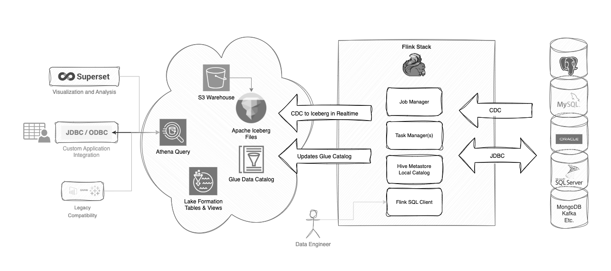

# Flink Stack

A `docker-compose` stack for Flink and Flink-SQL.

The primary focus of this `Flink Stack` is to support CDC to an AWS S3 Iceberg Data Lake in real time, enabling Athena and the Data Lake to act as a severless analytical datastore.  


The `Flink Stack` can handle moving data between source systems using CDC, as well as migrating that data to Iceberg on S3 in real time.  Everything can be managed through the `Fink SQL Client` using existing connectors and does not require custom Java development.

The `Flink Stack` can perform both streaming and batch ETL.

`CDC Sources` can be joined across systems to create real-time consolidated views, which can then be replicated to Apache Iceberg on S3, also in real-time.  `Iceberg` will update the `Glue Catalog` to enable Athena to read results in real time.

`Apache Iceberg` stores all change over time allowing for custom queries that show record change over time, or point in time values.




The `Flink Stack` includes:

- Minio for local S3 object storage
- Hive Metastore as a persistent Data Catalog
- Zookeeper for HA and job state 
- Flink CDC Connectors and [Jar Packs](./jar-packs)
- Integration of Apache Iceberg with AWS Glue

> It has been quite a ride getting Flink to standup with all of the other Apache dependencies.  Hopefully this stack spares others some suffering.

## Requirements

- Docker 
- Bash
- The [database-stack](https://github.com/seanhig/database-stack) is recommended.

## Usage

```
docker compose build
docker compose up -d
```

> The build will download hadoop and fetch a number of dependency jars.  Additional `jars` can be added to the `maven pom.xml` and the container can be re-built (However, this can be trickey, see more [below](#jar-usage-and-build-notes)).

And then once the stack is up and running you can shell into the `Flink-SQL client`:

```
./sql-client.sh
```
 
> Scaling the `taskmanager` can be done with `docker-compose scale taskmanager=3`.  Each taskmanager is configured to support 100 job slots.

See the [Streaming ETL](eg/streaming-etl/) example to get started with the `flink-stack`.

Happy flinking.

## Additional Components
The stack also includes `Minio` to simulate `AWS S3` locally.  View the Minio web interface at `http://localhost:9000`.


## Jar Usage and Build Notes

Flink is a great project, but an excellent illustration of the mess that has become Java Class loaders.  The entire mechanism when combined with dependency injection seems to completely overlook the complexity of managing the runtime environment.  Trying to get the various Apache projects to work together despite dependency conflicts is illustrative, and the nearly useless `ClassNotFoundException` or `java.lang.NoClassDefFoundError` exist only to waste your time.

Flink describes the [class loader hell](https://nightlies.apache.org/flink/flink-docs-master/docs/ops/debugging/debugging_classloading/) nicely.

I started out trying to keep Flink as pure as possible, with all required dependencies bundled into jars to be loaded by the Client class loader on a per job basis... but this simply does not work in many cases (as is the case with most of the Flink documentation examples).  So through trial and error I had to add some jars directly to the `/opt/flink/lib/stack` folder or they would simply not be picked up by the myriad of class loaders in the correct order/context.  `Iceberg` and `JDBC` are good examples of this.

Core formats `JSON, Parquet and AVRO` were also added to the image. `CSV` is built-in.

For situations where client level class loading worked, they are bundled into `Jar Packs` in the `/jar-packs` folder and mounted to the containers so that from within the `Flink SQL Client` they can be dynamically included:

```
ADD JAR '/jar-packs/flink-stack-mysql.jar';
```

At the present it seems `HADOOP_CLASSPATH` needs to exist, at least in some form, and the easiest way to accomplish this is to bundle the latest hadoop version into the Flink image.  Bundling Hadoop jars without shading them as embedded (in a Java code usage model) simply does not work.

See the `eg` folder for examples, most are based on the `streaming-etl` foundation.