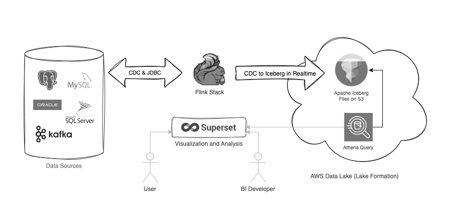

# Flink Stack

A `docker-compose` stack for Flink and Flink-SQL development.  It also illustrates examples of transcribing `Flink SQL` into deployable `Java jars`, built into immutable `Flink containers`, deployed via the `Flink Kubernetes Operator` into a K8s cluster.  See the [Examples](#flink-examples) section below.

The primary focus of this `Flink Stack` was to support CDC to an AWS S3 Iceberg Data Lake in real time, enabling Athena and the Data Lake to act as a severless analytical datastore.  



`CDC Sources` can be joined across systems to create real-time consolidated views accross disperate backend systems, which can then be replicated to Apache Iceberg on S3, in real-time.  This is the power of `Iceberg`, a `serde` format that allows for ongoing upserts. `Iceberg` will also update the `Glue Catalog` to enable Athena to read the updated results in real time.

The [streaming-etl-to-iceberg](examples/streaming-etl-to-iceberg/) walkthrough illustrates this flow.  It requires no Java development and uses only `Flink SQL` and the `SQL Client` for deployment.

`Apache Iceberg` stores all change over time allowing for custom queries that show record change deltas, or point in time values, adding additional power to the platform.

And because the datastore is `Iceberg serde`, operating costs are pennies on the dollar and scale-out serverless SQL engines such as [Athena]() or [Trino]() can be used to achieve highly efficient and performant analytics. This model also works very well for analytic and visualization support toolsets like PowerBI, Tableau and [Apache SuperSet]().  An AWS Lake Formation data lake provides a cost effective datastore to distribute datasets, and `Iceberg` enables these datasets to be up-to-the-minute fresh.


The `Flink Stack` currently includes:

- Minio for local S3 object storage
- Hive Metastore as a persistent Data Catalog
- Zookeeper for HA and job state 
- Flink CDC Connectors 
- Integration of Apache Iceberg with AWS Glue

> It has been quite a ride getting Flink to standup with all of the other Apache dependencies.  Hopefully this stack spares others some suffering.  There is much to be gleaned from the examples and structure.

## Requirements

- Docker 
- Bash

## Setup

Make sure to copy the `.env-sample` file to a `.env` file and add the correct AWS credentials and secret settings.

## Usage

```
docker compose build
docker compose up -d
```

This builds the base image with all depdencies, which include:

- CDC Connectors & JDBC Drivers for MySQL, Postgres, Oracle and SQL Server
- SerDe formats for JSON, Avro, Parquet and Iceberg (CSV and flat file are built into Flink)
- Hive Metastore dependencies for the local persistent Data Catalog

> The build will download hadoop and fetch a number of dependency jars into `/opt/flink/lib/stack` based on a Maven `pom.xml` file.  Additional `jars` can be added to the `maven pom.xml` and the container can be re-built, or they can be bundled into individual `jar-packs` and added at runtime (see below).

Once the stack is up and running you can shell into the `Flink-SQL client`:

```
./sql-client.sh
```
 
> Scaling the `taskmanager` can be done with `docker-compose scale taskmanager=3`.  Each taskmanager is configured to support 100 job slots.

See the [Streaming ETL to Iceberg](examples/streaming-etl-to-iceberg/) example to see what the `flink-stack` can do.

Happy flinking!

## Flink Examples

[streaming-etl-to-iceberg](examples/streaming-etl-to-iceberg/README.md) demonstrates the core flow of joining data between two backend systems: `MySQL ERPDB` and `PostgreSQL ShipDB`, accross three tables via `CDC`, with an auto-updating summary table stored in `MySQL OperationsDB` which is then replicated in real-time via `CDC` again to `Apache Iceberg Serde` stored in `AWS S3 Lake Formation` to be read by `AWS Athena`.

[streaming-etl-java](examples/streaming-etl-java/README.md) implementes the `Flink SQL` functionality in the `streaming-etl-to-iceberg` example using `Java` and the `Flink Table API`, and packages it into a job jar for deployment.

[k8s](examples/k8s/README.md) illustrates how to deploy the `Flink Kubernetes Operator` to a K8s cluster and then how to define a Job `YAML` declaration file that will deploy the `streaming-etl-java job jar` into a dedicated job flink cluster running in the Kubernetes environment.  This example also defines a workable configuration and secrets handling strategy for production deployments.

[kafka](examples/kafka/README.md) implements a `Web Order` intake simulator using [Apache Kafka](), and a `weborder-processor` using Spring Boot, JPA and Kafka to generate incoming order volumes for Flink analysis and processing. 


## Flink Workflow
Starting with `Flink SQL` and the sql client to prototype data flows using agile SQL statements is a great way to setup the structure of a job in development.  Then transcribing that job into a `Java` implementation and `Job JAR` for deployment to Kubernetes feels like a great workflow and platform for data movement and real time analytics.

## Flink Catalogs
The folks at decodable put out a lot of good info that has helped with navigating the Apache docs, or lack therof.  This is a great primer [article](https://www.decodable.co/blog/catalogs-in-flink-sql-a-primer) on `Flink Catalogs`.

Essentially a catalog will persist your table definitions and source file locations (metadata) between sessions.  The `Flink SQL Client` by default will use an in-memory catalog that will disappear with each session.

`Flink Stack` supports two catalogs:

1. `Hive Metastore` for local definitons to source systems as it is supported out of the box with Flink.
2. `Glue` via Iceberg for the `Glue Data Catalog` integration.  Generally this catalog is only used for target Iceberg tables.

## Jar Usage and Build Notes
It took a bit of hammering to finally grok the idea that core JARS such as the CDC or JDBC jars do not belong in JAR packs!  Nor do they belong in Java based job jars.

There is still residue from these attempts in the repo.

In `FlinkSQL` it is possible to add additional dependencies... however, this is not a good model for things like CDC connectors or drivers... it can work to a limited degree, but generally leads to class loading conflicts at runtime on anything non-trival.

Eg.
```
ADD JAR '/jar-packs/flink-stack-mysql.jar';
```

A better approach is to build your own Flink image with the core dependencies flushed out and working, which is the approach of `flink-stack` for both the docker compose and k8s operator deployments.

### Hadoop Dependency
At the present it seems `HADOOP_CLASSPATH` needs to exist, at least in some form, and the easiest way to accomplish this is to bundle the latest hadoop version into the Flink image.  Bundling Hadoop jars without shading them as embedded (in a Java code usage model) simply does not work.

