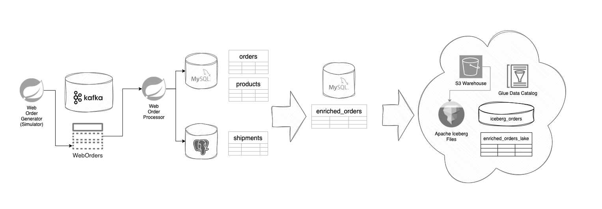

# Kafka Web Orders Processing with Flink, Avro, Spring Boot and Spring JPA / Kafka
This example explores Flink development with Kafka.



The `webordergen` is a Spring Boot Kafka application that generates fake orders at a pre-defined pace and places them on an [Apache Kafka]() topic in [Apache Avro]() format to simulate an online web application order system.

The `weborder-processor`is a Spring Boot Kafka and JPA application that consumes messages from the `weborders` Kafka topic and writes them to the `MySQL Orders` and `Postgres Shipments` tables respectively.

The `weborders` generated to the Kafka topic can then be used for analysis in [Apache Flink](), and serve as real world data input simulation for exploration of Flink CDC data movement and analytic processing.

> Initial plan was to use `Flink SQL` to intake directly from Kafka into the `MySQL` and `Postgres` tables, but this revealed a current limitation in Flink.  Specifically, it is presently not possible to stream into a table with a database based IDENTITY column.  


## The Web Order Model
The Web Order model is built using the [Apache Avro]() serialization format. This must be built and installed first as it is a depedency for the other two Spring projects:

```
cd weborder-model
mvn install
```

## The Web Order Generator
The `webordergen` must first be built into a `jar`:

```
cd webordergen
mvn package
```

And then it can be used to generate web orders of the `WebOrder` Avro model object to the Kafka topic:

```
java -jar target/webordergen-1.0.0.jar
```

This defaults to producing 50 web orders, in batches no larger then 25, with a pause between orders of 0-3 seconds and a pause between batches of 1-5 seconds.

with overrides:

```
java -jar target/webordergen-1.0.0.jar --count 500 --batchsizeMax 50 --orderpausemax 5 --batchpausemax 10

```

## The Web Order Processor
THe `weborder-processor` must be first built into a `jar`:

```
cd weborder-processor
mvn package
```

And then to process the Kafka topic web orders into the `MySQL` and `Postgres` databases:

```
java -jar target/weborder-processor-1.0.0.jar
```

This starts up a Spring Boot application that listens on the Kafka topic and uses JPA to process the `WebOrder` information into the `MySQL Orders` and `Postgres Shipments` tables respectively.

Kafka configuration is found in the Spring Boot `application.properties` file.
Database configuration is found in the `weborder-processor.propertoes` file.

## The Flink Web Order Monitor
The Flink Web Order Monitor can be installed into Flink to read from the Kafka topic and print the `WebOrder` messages in real time.  It serves as a template for reading Kafka topics and building stream analytics.  At the present time mostly a scaffold.

> Working with Spring was a pleasure and there was always well documented solutions to real-world requirements.  I can't say the same about Flink, as counting String streams for a Word count makes for a lame set of sample code.  It was a time suck trying to deserialize Avro messages from Kafka within Flink (involving the Schema Registry to boot).  Avro is a pretty common use case in terms of Kafka SerDe.  JSON is less ideal in Kafka, so it is odd Confluent chose it for their examples.  Simple, but not practical. I traced the problem down to a `SpecificRecord.class.isAssignableFrom()` issue that oddly routes the serializer toward an invalid `GenericRecord` path and produces a near worthless `NullException` instead of throwing a helpful message about the `isAssignableFrom` issue... but digging in the Flink source is no fun. It would be nice to be able to work with Avro `WebOrder` objects in Flink, but so far the best I've been able to accomplish is the `GenericRecord` option.  `Flink SQL` had no problem reading the Avro schema, so I'm sure there is a formula somewhere in the code... it is a TODO.