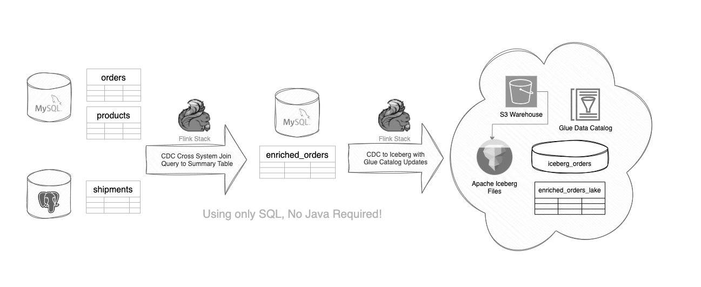
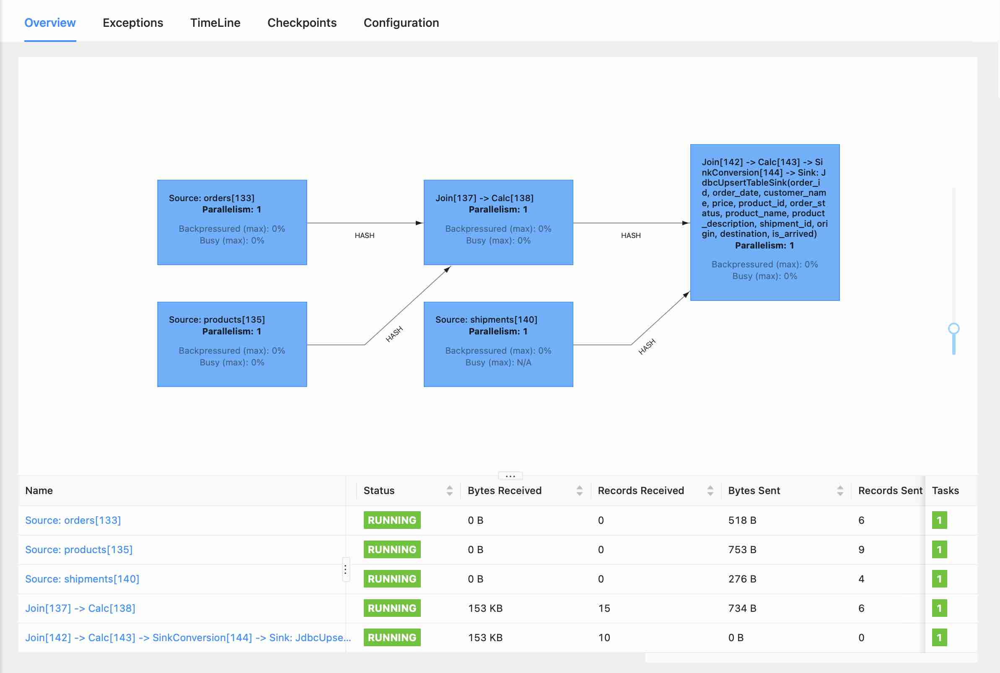

# Streaming ETL to Iceberg
## MySQL and PostgrSQL Sources -> MySQL Target Summary Table -> AWS S3 Iceberg Data Lake
This example uses CDC to capture changes on source MySQL and PostgreSQL tables, and joins them to create a new target table in another MySQL database.  Changes are replicated in real-time to the target table.  The job is defined using only `Flink-SQL` (no custom Java code).



## Requirements

- MySQL and PostgreSQL servers.  The [database-stack](https://github.com/seanhig/database-stack) was used in this example and works nicely.
- A running `flink-stack`
- Azure Data Studio or any other client that can connect to MySQL and PostgreSQL.
- Bash 

## MySQL Setup
MySQL hosts the `erpdb` database which contains the `products` and `orders` source tables.

Run the `erpdb.sql` script in MySQL.

```
-- MySQL source
SET GLOBAL binlog_format = 'ROW';
CREATE DATABASE erpdb;
USE erpdb;
CREATE TABLE products (
  id INTEGER NOT NULL AUTO_INCREMENT PRIMARY KEY,
  name VARCHAR(255) NOT NULL,
  description VARCHAR(512),
  price  DECIMAL(10, 5) NOT NULL
) AUTO_INCREMENT = 101;

INSERT INTO products
VALUES (default,"scooter","Small 2-wheel scooter", 107.00),
       (default,"car battery","12V car battery", 85.99),
       (default,"12-pack drill bits","12-pack of drill bits with sizes ranging from #40 to #3", 35.99),
       (default,"hammer","12oz carpenter's hammer", 12.50),
       (default,"hammer","14oz carpenter's hammer", 13.50),
       (default,"hammer","16oz carpenter's hammer", 15.25),
       (default,"rocks","box of assorted rocks", 4.99),
       (default,"jacket","water resistent black wind breaker", 24.99),
       (default,"spare tire","24 inch spare tire", 115.0);

CREATE TABLE orders (
  order_id INTEGER NOT NULL AUTO_INCREMENT PRIMARY KEY,
  order_date DATETIME NOT NULL,
  customer_name VARCHAR(255) NOT NULL,
  order_total DECIMAL(10, 5) NOT NULL,
  qty INTEGER NOT NULL,
  product_id INTEGER NOT NULL,
  order_status INTEGER NOT NULL 
) AUTO_INCREMENT = 10001;

INSERT INTO orders
VALUES (default, '2020-07-30 10:08:22', 'Jark', 85.99, 1, 102, 0),
       (default, '2020-07-30 10:11:09', 'Sally', 13.50, 1, 105, 0),
       (default, '2020-07-30 12:00:30', 'Edward', 15.25, 1, 106, 0);
```

MySQL also doubles as a `target` or `sink` with the database `operations`, which contains the output table `enriched_orders`, which is the result of a `Flink SQL` insert statement job.

Run the `operations.sql` script in MySQL also.

```
-- MySQL target 
CREATE DATABASE operations;
USE operations;

CREATE TABLE enriched_orders (
  order_id INTEGER NOT NULL PRIMARY KEY,
  order_date TIMESTAMP NOT NULL,
  customer_name VARCHAR(255) ,
  order_total DECIMAL(10, 5) ,
  product_id INTEGER NOT NULL,
  shipment_id INTEGER,
  origin VARCHAR(255),
  order_status INTEGER, 
  product_name VARCHAR(255),
  product_price DECIMAL(10, 5),
  order_qty INTEGER,
  product_description VARCHAR(512),
  destination VARCHAR(255),
  has_arrived BOOLEAN
);


```

## PostgreSQL Setup
PostgreSQL hosts the `shipdb` database which contains the `shipments` table.

Run the `shipdb.sql` script in PostgreSQL

```
-- PostgreSQL source
CREATE TABLE shipments (
  shipment_id SERIAL NOT NULL PRIMARY KEY,
  order_id SERIAL NOT NULL,
  origin VARCHAR(255) NOT NULL,
  destination VARCHAR(255) NOT NULL,
  has_arrived BOOLEAN NOT NULL
);
ALTER SEQUENCE public.shipments_shipment_id_seq RESTART WITH 1001;
ALTER TABLE public.shipments REPLICA IDENTITY FULL;
INSERT INTO shipments
VALUES (default,10001,'Warehouse A','Shanghai',false),
       (default,10002,'Warehouse B','Shanghai',false),
       (default,10003,'Warehouse A','Hangzhou',false);
```

## Flink-SQL for MySQL, Postgres CDC to MySQL Summary Table (enriched_orders)
Start the `Flink-SQL` client:

`docker compose run sql-client`

At the `Flink SQL>` prompt, enter the statements in the `flink-cdc.sql` script one by one.

```
-- Set options
SET execution.checkpointing.interval = 3s;
SET sql-client.execution.result-mode = 'tableau' ;

-- Flink SQL to define products and orders from erpdb
CREATE TABLE products (
    id INT,
    name STRING,
    description STRING,
    product_price DECIMAL(10, 5),
    PRIMARY KEY (id) NOT ENFORCED
)
WITH (
    'connector' = 'mysql-cdc',
    'hostname' = 'host.docker.internal',
    'port' = '3306',
    'username' = 'root',
    'password' = 'Fender2000',
    'database-name' = 'erpdb',
    'table-name' = 'products'
);

CREATE TABLE orders (
    order_id INT,
    order_date TIMESTAMP(0),
    customer_name STRING,
    order_total DECIMAL(10, 5),
    order_qty INTEGER,
    product_id INT,
    order_status INTEGER,
    PRIMARY KEY (order_id) NOT ENFORCED
)
WITH (
    'connector' = 'mysql-cdc',
    'hostname' = 'host.docker.internal',
    'port' = '3306',
    'username' = 'root',
    'password' = 'Fender2000',
    'database-name' = 'erpdb',
    'table-name' = 'orders'
);

-- Flink SQL to define shipments from PostgreSQL shipdb
CREATE TABLE shipments (
    shipment_id INT,
    order_id INT,
    origin STRING,
    destination STRING,
    has_arrived BOOLEAN,
    PRIMARY KEY (shipment_id) NOT ENFORCED
)
WITH (
    'connector' = 'postgres-cdc',
    'hostname' = 'host.docker.internal',
    'port' = '5432',
    'username' = 'postgres',
    'password' = 'Fender2000',
    'database-name' = 'shipdb',
    'schema-name' = 'public',
    'table-name' = 'shipments',
    'decoding.plugin.name' = 'pgoutput',
    'slot.name' = 'flink'
);


 -- Flink SQL to define the target enriched_orders table in the MySQL operational_datastore
CREATE TABLE enriched_orders (
    order_id INT,
    order_date TIMESTAMP(3),
    customer_name STRING,
    order_total DECIMAL(10, 5) ,
    order_qty INTEGER,
    product_id INTEGER,
    order_status INTEGER, 
    product_name STRING,
    product_description STRING,
    product_price DECIMAL(10, 5),
    shipment_id INTEGER,
    origin STRING,
    destination STRING,
    has_arrived BOOLEAN
    PRIMARY KEY (order_id) NOT ENFORCED
)
WITH (
    'connector.type' = 'jdbc',
    'connector.url' = 'jdbc:mysql://host.docker.internal:3306/operations',
    'connector.username' = 'root',
    'connector.password' = 'Fender2000',
    'connector.table' = 'enriched_orders'
);

-- Sets the job name for the any SQL that follows
SET 'pipeline.name' = 'MySQL-enriched_orders';

-- Creates a streaming ETL job to provide real-time updates to the enriched_orders table
INSERT INTO
    enriched_orders
SELECT o.*, p.name, p.description, p.price, s.shipment_id, s.origin, s.destination, s.is_arrived
FROM
    orders AS o
    LEFT JOIN products AS p ON o.product_id = p.id
    LEFT JOIN shipments AS s ON o.order_id = s.order_id;

```

The `insert statement` above will return:

```
[INFO] Submitting SQL update statement to the cluster...
[INFO] SQL update statement has been successfully submitted to the cluster:
Job ID: 51624193b43424c4ad780bc2a3dbcf16
```

Open the `localhost:8088` Flink management site and look under `Jobs/Running Jobs` and observe the `MySQL-enriched_orders` job.


Drill down into the job for additional details:


As well as detailed statistics:



From the `Flink SQL>` prompt you can enter commands like:

 ```
 SET 'pipeline.name' = 'MySQL-watch_orders';
 select * from orders
 ``` 
 
 to observe the changes as they are made, in real-time.

```
+----+-------------+----------------------------+--------------------------------+-------------+-------------+--------------+
| op |    order_id |                 order_date |                  customer_name |        price |  product_id | order_status |
+----+-------------+----------------------------+--------------------------------+--------------+-------------+--------------+
| +I |       10001 | 2020-07-30 10:08:22.000000 |                       JarkyDog |     50.50000 |         102 |        FALSE |
| +I |       10004 | 2020-07-30 15:22:00.000000 |                           Jark |     29.71000 |         104 |         TRUE |
| +I |       10003 | 2020-07-30 12:00:30.000000 |                         Edward |     25.25000 |         106 |        FALSE |
| +I |       10002 | 2020-07-30 10:11:09.000000 |                          Sally |     15.00000 |         105 |        FALSE |
| -U |       10001 | 2020-07-30 10:08:22.000000 |                       JarkyDog |     50.50000 |         102 |        FALSE |
| +U |       10001 | 2020-07-30 10:08:22.000000 |                      JarkyDog2 |     50.50000 |         102 |        FALSE |
```

Note the `+I` for insert, and the pre `-U` and post `+U` update values for the `customer_name` in record `10001`.

The changes are also `sinked` to the target `enriched_orders` table in real-time. And the above query will also show up as a `Running Job` for as long as it is active. 

## Flink-SQL for CDC from MySQL Summary Table to AWS S3 Iceberg Data Lake

See the [flink-iceberg](flink-iceberg.sql) file.

```
SET execution.checkpointing.interval = 3s;

SET 'sql-client.verbose' = 'true';

-- Iceberg CDC Source table

CREATE TABLE enriched_orders_cdc (
    order_id INT,
    order_date TIMESTAMP(3),
    customer_name STRING,
    order_total DECIMAL(10, 5) ,
    order_qty INTEGER,
    product_id INTEGER,
    order_status INTEGER, 
    product_name STRING,
    product_description STRING,
    product_price DECIMAL(10, 5),
    shipment_id INTEGER,
    origin STRING,
    destination STRING,
    has_arrived BOOLEAN
    PRIMARY KEY (order_id) NOT ENFORCED ) 
   WITH (
   'connector' = 'mysql-cdc',
   'hostname' = 'host.docker.internal',
   'port' = '3306',
   'username' = 'root',
   'password' = 'Fender2000',
   'database-name' = 'operations',
   'table-name' = 'enriched_orders'
 );

-- Catalog aligns with default Aws Catalog in account
CREATE CATALOG iceberg_catalog WITH (
  'type'='iceberg',
  'warehouse'='s3a://ids-flink-demo-warehouse',
  'catalog-impl'='org.apache.iceberg.aws.glue.GlueCatalog',
  'io-impl'='org.apache.iceberg.aws.s3.S3FileIO'
);

CREATE DATABASE iceberg_orders;

-- Verify in AWS Console that the database exists in the Glue Catalog

USE iceberg_orders;

CREATE TABLE enriched_orders_lake (
    order_id INT,
    order_date TIMESTAMP(3),
    customer_name STRING,
    order_total DECIMAL(10, 5) ,
    product_id INTEGER,
    shipment_id INTEGER,
    origin STRING,
    order_status INTEGER, 
    product_name STRING,
    product_price DECIMAL(10, 5),
    order_qty INTEGER,
    product_description STRING,
    destination STRING,
    has_arrived BOOLEAN
   PRIMARY KEY (order_id) NOT ENFORCED ) ;
   
SET 'pipeline.name' = 'Iceberg-enriched-orders-aws';

-- This will create the streaming CDC to Iceberg job
INSERT INTO iceberg_catalog.iceberg_orders.enriched_orders_lake SELECT * FROM default_catalog.default_database.enriched_orders_cdc;

```

Once the job has been submitted the data can be viewed using `AWS Athena` and queried like any other table in the `Glue Catalog`.  Updates will occur in real-time and can be verified through the query interface and consuming clients, such as `Apache Superset`.
