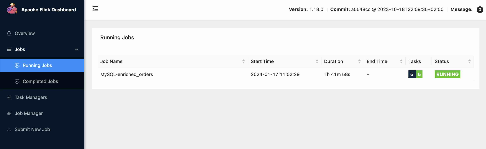
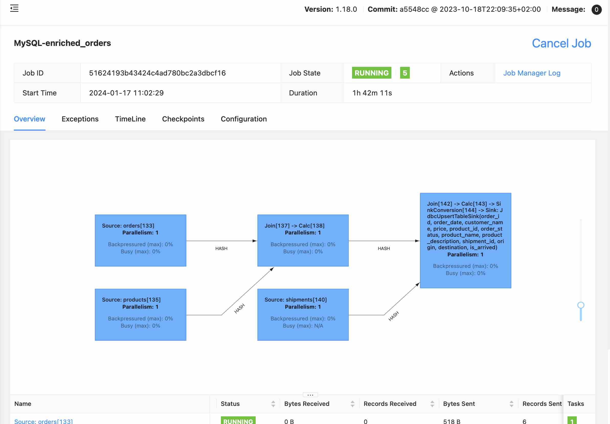
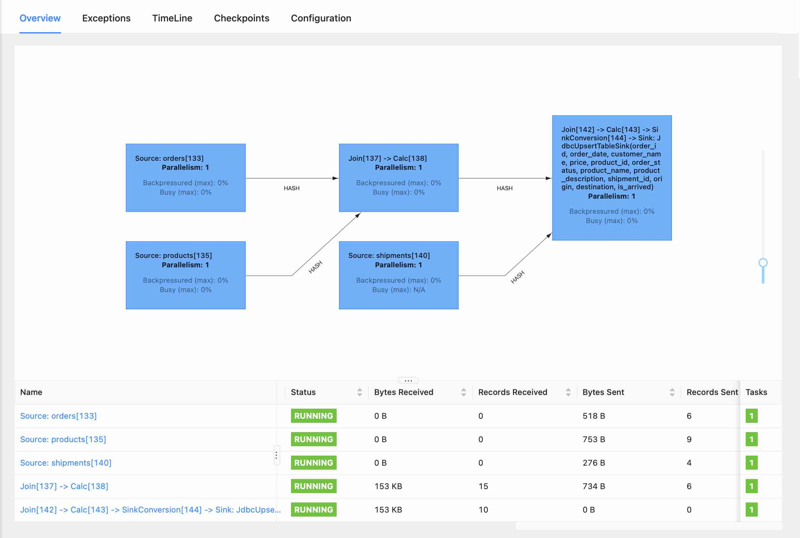

# Streaming ETL - MySQL and PostgrSQL Sources -> MySQL Target
This example uses CDC to capture changes on source MySQL and PostgreSQL tables, and joins them to create a new target table in another MySQL database.  Changes are replicated in real-time to the target table.  The job is defined using only `Flink-SQL`.

This represents an agile approach to data integration and movement, while enabling an `Event Driven Architecture`.  The `Streaming ETL + CDC` model enables incremental adoption of eventing as consumers can listen in on active streams for change events.

__Extraction__ is handled by the CDC mechanism and is delivered a real-time stream of change.

__Transformation__ is accomplished using simple `SQL` statements which are easily versioned and managed in a central integration Git repository.  For complex transformations jobs can be developed using `Java`, but most can be developed using plain old `SQL` syntax.

__Loading__ is handled by the JDBC `sink` streams.

Everything is declarative (short of customzied `Java` based jobs), and can be easily version controlled and managed in a `GitOps` style.

When combined with [The Flink Kubernetes Operator](https://nightlies.apache.org/flink/flink-kubernetes-operator-docs-main/) it offers a compelling and powerful integration and ETL platform.

## Requirements

- MySQL and PostgreSQL servers.  The [database-stack](https://github.com/seanhig/database-stack) was used in this example and works nicely.
- A running `flink-stack`
- Bash 

## Setup

Download the following `jar` files and place them in the `host/jars` folder before laumching the `flink-stack`:

[Flink Connectors for CDC](https://github.com/ververica/flink-cdc-connectors/releases/)

    flink-cdc-dist-3.0.0.jar
    flink-cdc-pipeline-connector-mysql-3.0.0.jar 
    flink-sql-connector-sqlserver-cdc-3.0.0.jar  
    flink-sql-connector-mysql-cdc-3.0.0.jar      
    flink-sql-connector-postgres-cdc-3.0.0.jar   
    flink-sql-connector-oracle-cdc-3.0.0.jar     

[Flink Connector for JDBC](https://mvnrepository.com/artifact/org.apache.flink/)

    flink-connector-jdbc_2.12)
    flink-connector-jdbc_2.12-1.14.6.jar         


[JDBC Drivers](https://nightlies.apache.org/flink/flink-docs-master/docs/connectors/table/jdbc/)

    mysql-connector-j-8.3.0.jar
    ojdbc10-19.21.0.0.jar
    mssql-jdbc-12.4.2.jre11.jar                  
    mssql-jdbc-12.4.2.jre8.jar
    postgresql-42.7.1.jar


## MySQL

MySQL hosts the `erpdb` database which contains the `products` and `orders` source tables.

Run the `erpdb.sql` script in MySQL.

```
-- MySQL
CREATE DATABASE erpdb;
USE erpdb;
CREATE TABLE products (
  id INTEGER NOT NULL AUTO_INCREMENT PRIMARY KEY,
  name VARCHAR(255) NOT NULL,
  description VARCHAR(512)
);
ALTER TABLE products AUTO_INCREMENT = 101;

INSERT INTO products
VALUES (default,"scooter","Small 2-wheel scooter"),
       (default,"car battery","12V car battery"),
       (default,"12-pack drill bits","12-pack of drill bits with sizes ranging from #40 to #3"),
       (default,"hammer","12oz carpenter's hammer"),
       (default,"hammer","14oz carpenter's hammer"),
       (default,"hammer","16oz carpenter's hammer"),
       (default,"rocks","box of assorted rocks"),
       (default,"jacket","water resistent black wind breaker"),
       (default,"spare tire","24 inch spare tire");

CREATE TABLE orders (
  order_id INTEGER NOT NULL AUTO_INCREMENT PRIMARY KEY,
  order_date DATETIME NOT NULL,
  customer_name VARCHAR(255) NOT NULL,
  price DECIMAL(10, 5) NOT NULL,
  product_id INTEGER NOT NULL,
  order_status BOOLEAN NOT NULL -- Whether order has been placed
) AUTO_INCREMENT = 10001;

INSERT INTO orders
VALUES (default, '2020-07-30 10:08:22', 'Jark', 50.50, 102, false),
       (default, '2020-07-30 10:11:09', 'Sally', 15.00, 105, false),
       (default, '2020-07-30 12:00:30', 'Edward', 25.25, 106, false);
```

MySQL also doubles as a `target` or `sink` with the database `operations`, which contains the output table `enriched_orders`, which is the result of a `Flink SQL` insert statement job.

Run the `operations.sql` script in MySQL also.

```
CREATE DATABASE operational_datastore;
USE operational_datastore;

CREATE TABLE enriched_orders (
  order_id INTEGER NOT NULL PRIMARY KEY,
  order_date TIMESTAMP NOT NULL,
  customer_name VARCHAR(255) ,
  price DECIMAL(10, 5) ,
  product_id INTEGER NOT NULL,
  shipment_id INTEGER,
  origin VARCHAR(255),
  order_status BOOLEAN, -- Whether order has been placed
  product_name VARCHAR(255),
  product_description VARCHAR(512),
  destination VARCHAR(255),
  is_arrived BOOLEAN
);

```

## PostreSQL

PostgreSQL hosts the `shipdb` database which contains the `shipments` table.

Run the `shipdb.sql` script in PostgreSQL

```
-- PostgreSQL source

CREATE TABLE shipments (
  shipment_id SERIAL NOT NULL PRIMARY KEY,
  order_id SERIAL NOT NULL,
  origin VARCHAR(255) NOT NULL,
  destination VARCHAR(255) NOT NULL,
  is_arrived BOOLEAN NOT NULL
);
ALTER SEQUENCE public.shipments_shipment_id_seq RESTART WITH 1001;
ALTER TABLE public.shipments REPLICA IDENTITY FULL;
INSERT INTO shipments
VALUES (default,10001,'Beijing','Shanghai',false),
       (default,10002,'Hangzhou','Shanghai',false),
       (default,10003,'Shanghai','Hangzhou',false);
```

## Flink-SQL

Start the `Flink-SQL` client:

`docker-compose run sql-client`

At the `Flink SQL>` prompt, enter the statements in the `flink.sql` script one by one.

```
-- Set options
SET execution.checkpointing.interval = 3s;
SET sql-client.execution.result-mode = 'tableau' ;

-- Flink SQL to define products and orders from erpdb
CREATE TABLE products (
    id INT,
    name STRING,
    description STRING,
    PRIMARY KEY (id) NOT ENFORCED
  ) WITH (
    'connector' = 'mysql-cdc',
    'hostname' = 'host.docker.internal',
    'port' = '3306',
    'username' = 'root',
    'password' = 'Fender2000',
    'database-name' = 'erpdb',
    'table-name' = 'products'
  );

CREATE TABLE orders (
   order_id INT,
   order_date TIMESTAMP(0),
   customer_name STRING,
   price DECIMAL(10, 5),
   product_id INT,
   order_status BOOLEAN,
   PRIMARY KEY (order_id) NOT ENFORCED
 ) WITH (
   'connector' = 'mysql-cdc',
   'hostname' = 'host.docker.internal',
   'port' = '3306',
   'username' = 'root',
   'password' = 'Fender2000',
   'database-name' = 'erpdb',
   'table-name' = 'orders'
 );

-- Flink SQL to define shipments from PostgreSQL shipdb
CREATE TABLE shipments (
   shipment_id INT,
   order_id INT,
   origin STRING,
   destination STRING,
   is_arrived BOOLEAN,
   PRIMARY KEY (shipment_id) NOT ENFORCED
 ) WITH (
   'connector' = 'postgres-cdc',
   'hostname' = 'host.docker.internal',
   'port' = '5432',
   'username' = 'postgres',
   'password' = 'Fender2000',
   'database-name' = 'shipdb',
   'schema-name' = 'public',
   'table-name' = 'shipments',
   'decoding.plugin.name' = 'pgoutput',
   'slot.name' = 'flink'
 );


 -- Flink SQL to define the target enriched_orders table in the MySQL operational_datastore
CREATE TABLE enriched_orders (
   order_id INT,
   order_date TIMESTAMP(3),
   customer_name STRING,
   price DECIMAL(10, 5),
   product_id INT,
   order_status BOOLEAN,
   product_name STRING,
   product_description STRING,
   shipment_id INT,
   origin STRING,
   destination STRING,
   is_arrived BOOLEAN,
   PRIMARY KEY (order_id) NOT ENFORCED
  ) WITH (
    'connector.type' = 'jdbc',
    'connector.url' = 'jdbc:mysql://host.docker.internal:3306/operational_datastore',
    'connector.username' = 'root',
    'connector.password' = 'Fender2000',
    'connector.table' = 'enriched_orders'
  );

-- Sets the job name for the any SQL that follows
SET 'pipeline.name' = 'MySQL-enriched_orders';

-- Creates a streaming ETL job to provide real-time updates to the enriched_orders table
INSERT INTO enriched_orders
 SELECT o.*, p.name, p.description, s.shipment_id, s.origin, s.destination, s.is_arrived
 FROM orders AS o
 LEFT JOIN products AS p ON o.product_id = p.id
 LEFT JOIN shipments AS s ON o.order_id = s.order_id;

```

The `insert statement` above will return:

```
Flink SQL> INSERT INTO enriched_orders
>  SELECT o.*, p.name, p.description, s.shipment_id, s.origin, s.destination, s.is_arrived
>  FROM orders AS o
>  LEFT JOIN products AS p ON o.product_id = p.id
>  LEFT JOIN shipments AS s ON o.order_id = s.order_id;
> 
[INFO] Submitting SQL update statement to the cluster...
[INFO] SQL update statement has been successfully submitted to the cluster:
Job ID: 51624193b43424c4ad780bc2a3dbcf16
```

Open the `localhost:8081` Flink management site and look under `Jobs/Running Jobs` and observe the `MySQL-enriched_orders` job.



Drill down into the job for additional details:



As well as detailed statistics:



From the `Flink SQL>` prompt you can enter commands like:

 ```
 SET 'pipeline.name' = 'MySQL-watch_orders';
 select * from orders
 ``` 
 
 to observe the changes as they are made, in real-time.

```
+----+-------------+----------------------------+--------------------------------+-------------+-------------+--------------+
| op |    order_id |                 order_date |                  customer_name |        price |  product_id | order_status |
+----+-------------+----------------------------+--------------------------------+--------------+-------------+--------------+
| +I |       10001 | 2020-07-30 10:08:22.000000 |                       JarkyDog |     50.50000 |         102 |        FALSE |
| +I |       10004 | 2020-07-30 15:22:00.000000 |                           Jark |     29.71000 |         104 |         TRUE |
| +I |       10003 | 2020-07-30 12:00:30.000000 |                         Edward |     25.25000 |         106 |        FALSE |
| +I |       10002 | 2020-07-30 10:11:09.000000 |                          Sally |     15.00000 |         105 |        FALSE |
| -U |       10001 | 2020-07-30 10:08:22.000000 |                       JarkyDog |     50.50000 |         102 |        FALSE |
| +U |       10001 | 2020-07-30 10:08:22.000000 |                      JarkyDog2 |     50.50000 |         102 |        FALSE |
```

Note the `+I` for insert, and the pre `-U` and post `+U` update values for the `customer_name` in record `10001`.

The changes are also `sinked` to the target `enriched_orders` table in real-time. And the above query will also show up as a `Running Job` for as long as it is active. 

This enables `Jobs` to listen in on active `streaming tables` when they are interested in being notified of changes, without need for a streaming service like `Kafka` or `Kinesis`, if there is no need to perist the record of change events.

`Kafka` or `Kinesis` can be inserted into the workflow to introduce a log of change over time, and another way for clients to listen for change events as they are occurring.  With underlying stream technology those changes can also be replayed or rewound.

